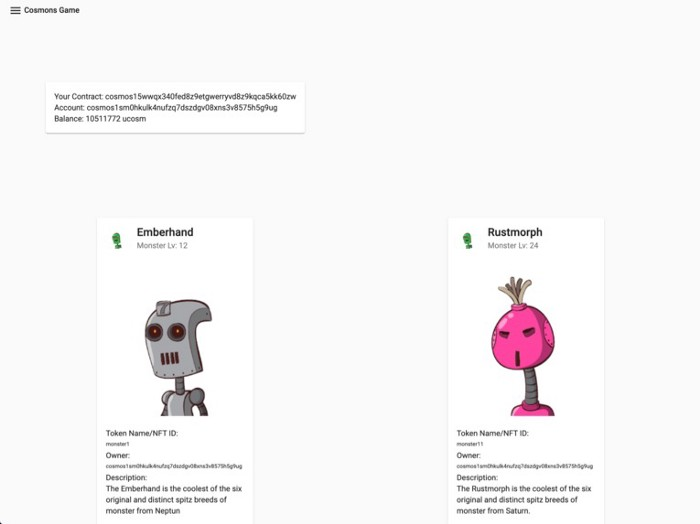

# Hall of Fame

_**Here we present yout the CosmWasm hall of fame! Kudos the contributors for their effort in making these amazing projects!**_
Let's give them the visibility and fame they deserve:

## NFT Marketplace by BlockScape

Article: [https://devpost.com/software/nft-marketplace](https://devpost.com/software/nft-marketplace)

Won **1st place in Galileo Awards**(Most creative dAppchain using Cosmos SDK & Tendermint, with option to use IBC) and 3rd place in Gringotts Awards.

The NFT marketplace provides a generic platform for selling and buying CW721 tokens with CW20 tokens. People can put their tokens up for sale and buy tokens from other sellers.
We have already seen a couple of example implementations of trading NFTs between two accounts, but all of them were on a per-contract basis. That means that for each trade, there was a separate contract which made it hard to know which tokens were actually up for sale and which token was used. This leads us to the idea of providing one central place to put tokens up for sale for maximum visibility of token sales.
The project demonstrates CosmWasm contract interaction very well by using 3 deployed contracts on the chain. You can see how the team implemented a custom cw721 contract here. The team contributed to the NFT contract by developing a typescript helper client. Also, the project has Keplr wallet integrated.

Demo: [https://hackatom.blockscape.network/home](https://hackatom.blockscape.network/home)

Repo: [https://github.com/BlockscapeNetwork/hackatom_v](https://github.com/BlockscapeNetwork/hackatom_v)

## Clawback Account

Article: [https://devpost.com/software/clawback-account-in-cosmwasm](https://devpost.com/software/clawback-account-in-cosmwasm)

Won the **1st place in Gaia Awards**(Best go-to-market project for Cosmos Hub)
Inspired by Bitcoin Vaults.
The code quality of this project is top-tier. This was evidenced by very extensive contract unit tests.
It’s a prototype contract code for “clawbacks” of native and CW20 tokens. A clawback works as follows:
There is a “holder” key/account, a “backup” key/account, and a “clawback period” (which determines when the clawback expires).
Within a “clawback period”, “holder” can transfer to “holders” / other clawbacks (provided their terms match the outgoing contract: they have the same “backup”, “clawback period” is at least as long, and they support the same tokens) or refresh the clawback duration. After the clawback period expires, the “holder” can withdraw the tokens.
Within a “clawback period”, “backup” can transfer to another holder, refresh the clawback duration or burn the tokens / destroy the contract.

Presentation: [https://docs.google.com/presentation/d/13aEcVFhjQFKo9bGjHe0V9HiHnqbM7eGSHbDB27Psa24/edit?usp=sharing](https://docs.google.com/presentation/d/13aEcVFhjQFKo9bGjHe0V9HiHnqbM7eGSHbDB27Psa24/edit?usp=sharing)

Repo: [https://github.com/tomtau/hackatom](https://docs.google.com/presentation/d/13aEcVFhjQFKo9bGjHe0V9HiHnqbM7eGSHbDB27Psa24/edit?usp=sharing)

## Random Beacon

Article: [https://medium.com/confio/when-your-blockchain-needs-to-roll-the-dice-ed9da121f590](https://medium.com/confio/when-your-blockchain-needs-to-roll-the-dice-ed9da121f590)

Distributed random number generator by Simon Warta.

In drand, random beacons are distributed via HTTP, Gossipsub, Tor or Twitter. Such network sources cannot be accessed by a blockchain directly. However, we can create a CosmWasm smart contract which allows storing random beacons on chain. Using cross-contract queries, other contracts can then read those random values and use them in their logic.

Repo: [https://github.com/confio/rand](https://github.com/confio/rand)

## Sophon

Article: [https://devpost.com/software/sophon](https://devpost.com/software/sophon)

Won **3rd place on Gaia Award.**
Just as [yearn.finance](https://yearn.finance/) on Ethereum can optimize DeFi’s operations, the team thought a smart contract on CosmWasm could optimize Staking’s operations.
When funds are deposited into a contract, it will delegate the funds to the validator with the highest interest rate per Redelegate.

Repo: [https://github.com/Ninja-Chain/sophon](https://github.com/Ninja-Chain/sophon)