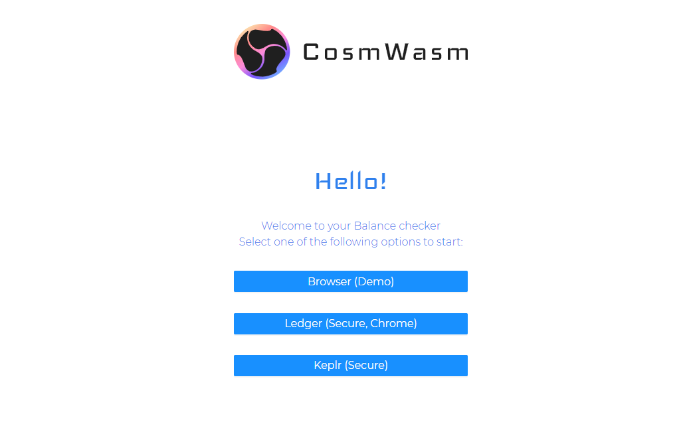
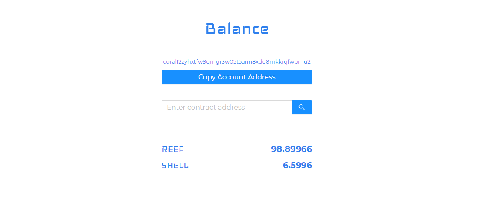
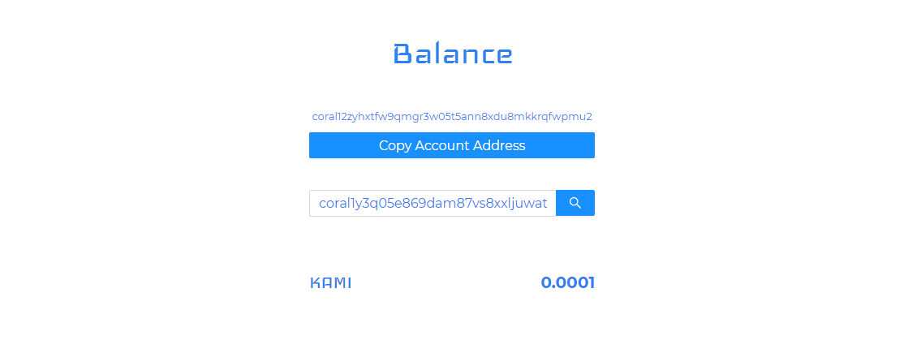

# Introduction

In this tutorial you will learn how to build a [CosmJS](https://github.com/cosmos/cosmjs) based dApp. The example dApp
will be a balance checker that will allow you to see your native tokens and the CW20 tokens of the contract with the
address you enter.

## Views {#views}

It will look like this:

### Login {#login}

### Native balance {#native-balance}

### Balance of a CW20 contract {#balance-of-a-cw20-contract}

### Error for address with no contract {#error-for-address-with-no-contract}

## Setup environment {#setup-environment}

We recommend to use [Visual Studio Code](https://code.visualstudio.com) but this tutorial should be easily followed with
any other text editor.

You should download the latest release of the [`CosmWasm/dApps`](https://github.com/CosmWasm/dApps) monorepo using your
preferred method.
