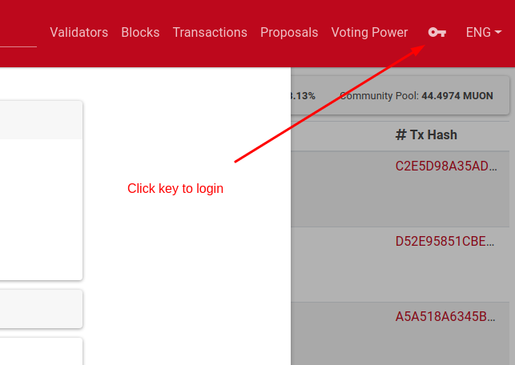
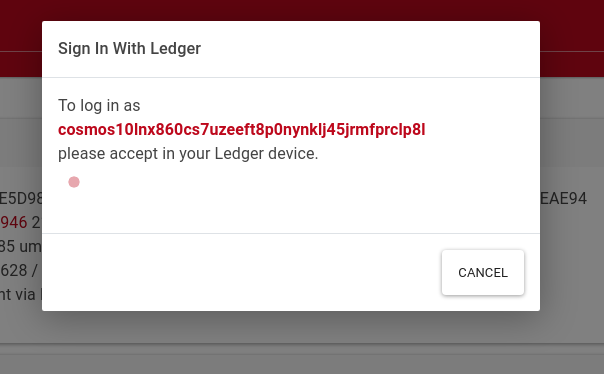
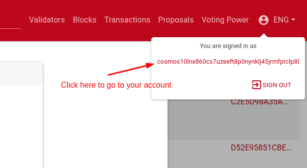
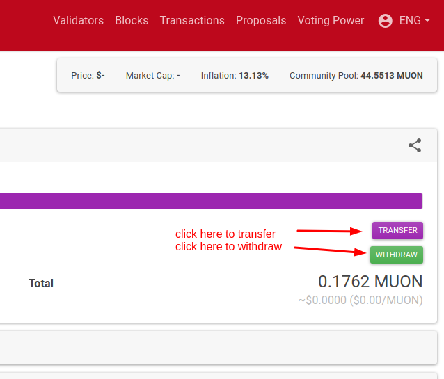
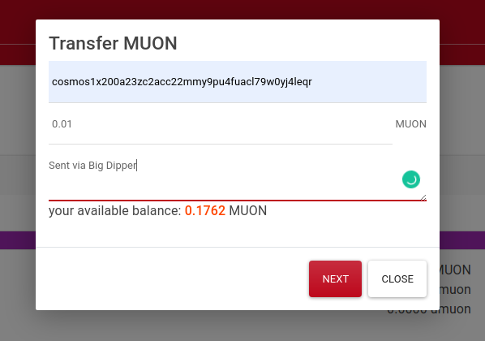

# Using Big Dipper

For exploring the testnets, you can use big-dipper instances:
- gaia-flex: [https://bigdipper.gaia-flex.cosmwasm.com](https://bigdipper.gaia-flex.cosmwasm.com)
- heldernet: [https://bigdipper.heldernet.cosmwasm.com](https://bigdipper.heldernet.cosmwasm.com)

Big-dipper provides almost complete ux for exploring the chain.
Suit your self and take a look around the website. I am sure it will fulfull your needs.

## Sending Transactions Using Big Dipper

::: danger
At the moment Big Dipper only supports ledger transaction signing.
:::

1. First plug your ledger and open cosmos app.
2. 
3. 
4. 
5. 
6. 
7. Press sign.
8. Check and verify on ledger.
9. Transaction will be broadcasted and hash will be prompted. You see the tx by clicking first link.

