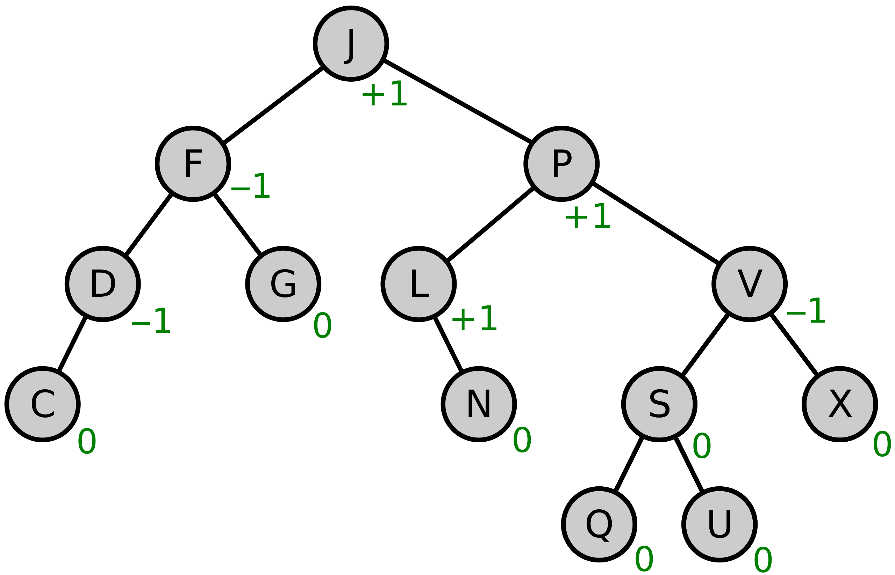

# How CW Key Value Storage Works?

Cosmos-SDK storage as mentioned is a KV store. Each value saved under a key. The storage structured with Tree
modeling. Specifically [cosmos/iavl](https://github.com/cosmos/iavl) tree structure.

Here is an explanation of how key value storage work:

*This is a very simplified explanation for just wrapping heads around KV store iterators.*

Letter inside circles are keys, and each key corresponds to a value.

Let's assume these are the saved key value pairs:

- `J` -> value1
- `JF` -> value2
- `JPV` -> value3
- `JPVA` -> value4
- `JPVD` -> value5
- `JPVX` -> value6

Retrieving single value with a known key is a cheap operation O(1). how to iterate over keys then?
Iteration can be done via prefixes.

- `J` key, prefixes: `J`
- `JF` key, prefixes: `J`, `JF`
- `JPV` key, prefixes: `J`,`JP`, `JPV`
- `JPVA` key, prefixes: `J`,`JP`, `JPV`, `JPVA`
- `JPVD` key, prefixes: `J`,`JP`, `JPV`, `JPVD`
- `JPVX` key, prefixes: `J`,`JP`, `JPV`, `JPVX`

range(`J`) returns all keys because all have `J` as prefix
range(`JF`) returns only `JF`

This is where it gets interesting:
range(`JPV`) returns `JPV`, `JPVA`, `JPVD`, `JPVX` in order
As you can see `J` or `JF` is not returned, because values after `JPV` is requested.

But why `JPVA` returned?

Keys saved to storage as fixed length. The representation of `JPVA` in storage is (assuming keys are 8 chars)
`JPVA0000`. Range request translates to in the background: iterate from `JPV00000` to `JPVFFFFF`. `JPVA` and others
are falls into this range. Also range query can be run in reverse.

These are the only two functionalities there are: get single value, iterate.

Most of the time complex relations between data structures must be established, but all we have this limited key value
storage.

This is done by building [indexes](indexes.md).
